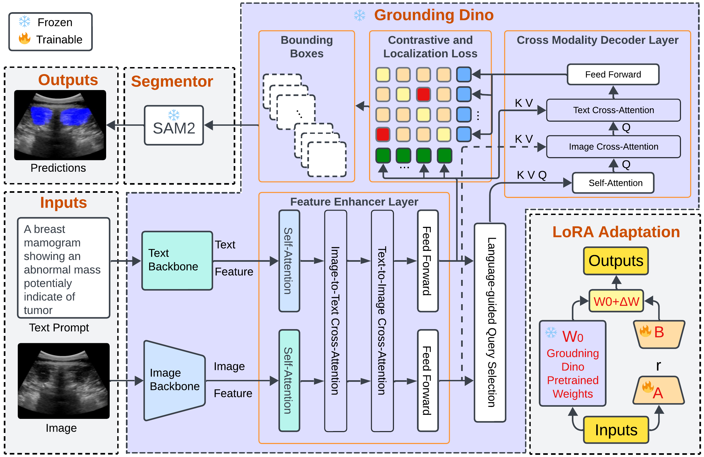

# GroundingDINO-US-SAM

**[IMPACT Lab](https://users.encs.concordia.ca/~impact/)** 

[Hamze Rasaee](https://scholar.google.com/citations?user=s_8vHW4AAAAJ&hl=en), [Taha Koleilat](https://tahakoleilat.github.io/), [Khashayar Rafat Zand](https://www.linkedin.com/in/drkhashy/?originalSubdomain=ca), [Hassan Rivaz](https://users.encs.concordia.ca/~hrivaz/)

**Try the online demo:** [segmentus.sonography.ai](https://segmentus.sonography.ai)

[](https://segmentus.sonography.ai)
[](https://ieeexplore.ieee.org/document/11146904)
[](https://arxiv.org/abs/2506.23903)

**Paper Title:**  
📄 *Grounding DINO-US-SAM: Text-Prompted Multi-Organ Segmentation in Ultrasound with LoRA-Tuned Vision–Language Models*
---
## Overview

## 🧠 Abstract
Accurate and generalizable object segmentation in ultrasound imaging remains a significant challenge due to anatomical variability, diverse imaging protocols, and limited annotated data. In this study, we propose a prompt-driven vision-language model (VLM) that integrates Grounding DINO with SAM2 to enable object segmentation across multiple ultrasound organs. A total of 18 public ultrasound datasets, encompassing the breast, thyroid, liver, prostate, kidney, and paraspinal muscle, were utilized. These datasets were divided into 15 for fine-tuning and validation of Grounding DINO using Low Rank Adaptation (LoRA) to the ultrasound domain, and 3 were held out entirely for testing to evaluate performance in unseen distributions. Comprehensive experiments demonstrate that our approach outperforms state-of-the-art segmentation methods, including UniverSeg, MedSAM, MedCLIP-SAM, BiomedParse, and SAMUS on most seen datasets while maintaining strong performance on unseen datasets without additional fine-tuning. These results underscore the promise of VLMs in scalable and robust ultrasound image analysis, reducing dependence on large, organ-specific annotated datasets.

### Model

<p float="left">
  
</p>

### Sample Segmentation Results on Seen Dataset
<p float="left">
  
</p>

### Sample Segmentation Results on Unseen Dataset
<p float="left">
  
</p>

### Sample Segmentation Multi Results
<p float="left">
  
</p>

## 🗂 Datasets

This study utilized **18 public ultrasound datasets** spanning a wide range of anatomical targets: **breast, thyroid, liver, prostate, kidney**, and **paraspinal muscle**. These were divided into:

- **15 datasets** for fine-tuning and validation of Grounding DINO
- **3 held-out datasets** (highlighted below) for **testing on unseen domains** (no exposure during training or validation)

While most baselines used the same training and test splits, **UniverSeg** required a small **16-image support set** even for unseen datasets. Therefore, we provided 16 annotated images from each unseen dataset to ensure fair comparison.

- Create a directory for your data that you want to work with in the main working directory like the following:

```shell
multimodal-data
|── train.CSV
|── val.CSV
|── test.CSV
├── train
│   ├── train_images
├── val
│   ├── val_images
└──       
```

- Create CSV file for training and validation with format below
  - Promt (label_name)
  - Bounding Box (bbox_x,bbox_y,bbox_width,bbox_height)
  - Image (image_name,image_width,image_height)
  - Dataset Type(dataset)
``` csv
label_name,bbox_x,bbox_y,bbox_width,bbox_height,image_name,image_width,image_height,dataset
benign,100,80,241,109,breast_case146.png,433,469,breast
```

## Public Ultrasound Datasets

Public ultrasound datasets used in this study and their distribution across train, validation, and test sets.  
🚫 **Datasets used exclusively for testing** (not seen during training or validation).  
The only exception is the UniverSeg baseline, which requires a 16-image support set (16 manually segmented images from each unseen dataset were provided).

| Organ       | Dataset   | Total | Train | Val | Test |
|-------------|-----------|-------|-------|-----|------|
| **Breast**  | BrEaST    | 252   | 176   | 50  | 26   |
|             | BUID      | 233   | 161   | 46  | 26   |
|             | BUSUC     | 810   | 566   | 161 | 83   |
|             | BUSUCML   | 264   | 183   | 52  | 29   |
|             | BUSB      | 163   | 114   | 32  | 17   |
|             | BUSI      | 657   | 456   | 132 | 69   |
|             | STU       | 42    | 29    | 8   | 5    |
|             | S1        | 202   | 140   | 40  | 22   |
| 🚫 **Breast** | **BUSBRA** | 1875  | —     | —   | 1875 |
| **Thyroid** | TN3K      | 3493  | 2442  | 703 | 348  |
|             | TG3K      | 3565  | 2497  | 713 | 355  |
| 🚫 **Thyroid** | **TNSCUI** | 637   | —     | —   | 637  |
| **Liver**   | 105US     | 105   | 73    | 21  | 11   |
|             | AUL       | 533   | 351   | 120 | 62   |
| **Prostate**| MicroSeg  | 2283  | 1527  | 495 | 261  |
|             | RegPro    | 4218  | 2952  | 843 | 423  |
| **Kidney**  | kidneyUS  | 1963  | 1257  | 465 | 241  |
| 🚫 **Back Muscle** | **Luminous** | 296   | —     | —   | 296  |
| **Total**   | —         | **18783** | **12924** | **3881** | **1978** |


**🔢 Total:**  
- 18 datasets  
- **18,783** images  
- **12,924** train / **3,881** val / **1,978** test
---

## Prerequisites & Installation
Install GPU driver then test:
```
nvidia-smi
```

Install anaconda following the [anaconda installation documentation](https://docs.anaconda.com/anaconda/install/).
Create an environment with all required packages with the following command :
```bashscript
conda env create -f gdinousam.yml
conda activate gdinousam
pip install -r requirements.txt
pip install -e .
```

## How to run

### Train:
1. Prepare your dataset with images and related prompts, following the structure and CSV format described above.
2. **Review and modify** the parameters in `configs/train_config.yaml` (e.g., paths, hyperparameters) to match your setup.
3. Run the training script:
```bash
   python train.py
```

## Test:
Visualize results of training on test images. **See `configs/test_config.yaml` for detailed testing configurations.**

``` bash
python test.py
```

### Other Tests [BiomedParse, MedClipSam, MedClipSamV2, MedSam, SamUS, Sam2, `GroundingDINOUSAM (Ours)`]

``` bash
python testBiomedParse.py
python testMedClipSam.py
python testMedClipSamV2.py
python testMedSam.py
python testSAMUS.py
python testSam2.py

python testGroundingDINOUSAM.py

```

## Acknowledgements

Special thanks to [grounding_dino](https://github.com/IDEA-Research/GroundingDINO), [segment-anything](https://github.com/facebookresearch/segment-anything) and [Grounding DINO Fine-tuning](https://github.com/Asad-Ismail/Grounding-Dino-FineTuning) for making their valuable code publicly available.


## Citation

If you use `GroundingDINO-US-SAM`, please consider citing:

  @ARTICLE{11146904,
  
    author={Rasaee, Hamza and Koleilat, Taha and Rivaz, Hassan},
    
    journal={IEEE Transactions on Ultrasonics, Ferroelectrics, and Frequency Control}, 
    
    title={Grounding DINO-US-SAM: Text-Prompted Multiorgan Segmentation in Ultrasound With LoRA-Tuned Vision–Language Models}, 
    
    year={2025},
    
    volume={72},
    
    number={10},
    
    pages={1414-1425},
    
    keywords={Ultrasonic imaging;Image segmentation;Breast;Grounding;Training;Imaging;Adaptation models;Acoustics;Thyroid;Liver;Grounding DINO;prompt-driven segmentation;segment anything model (SAM) SAM2;ultrasound image segmentation;vision–language models (VLMs)},
    
    doi={10.1109/TUFFC.2025.3605285}}
